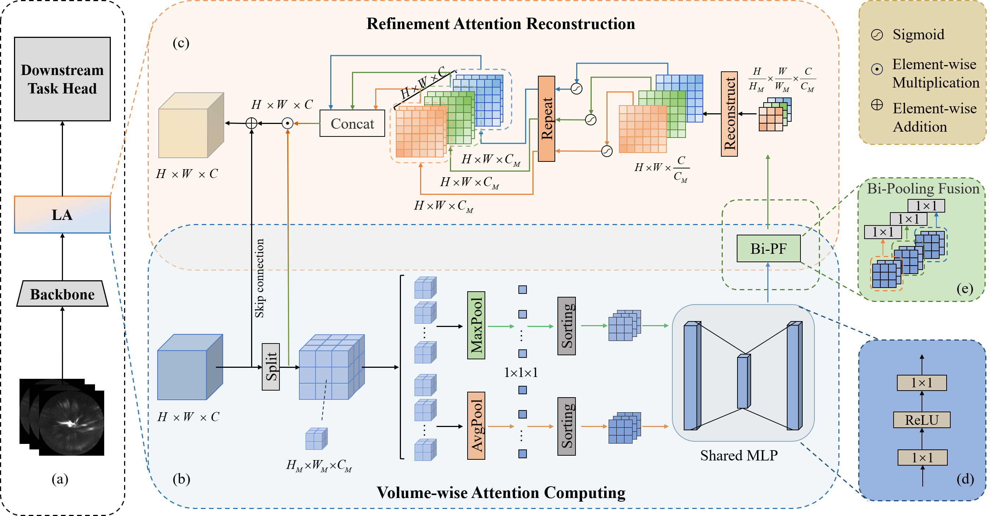
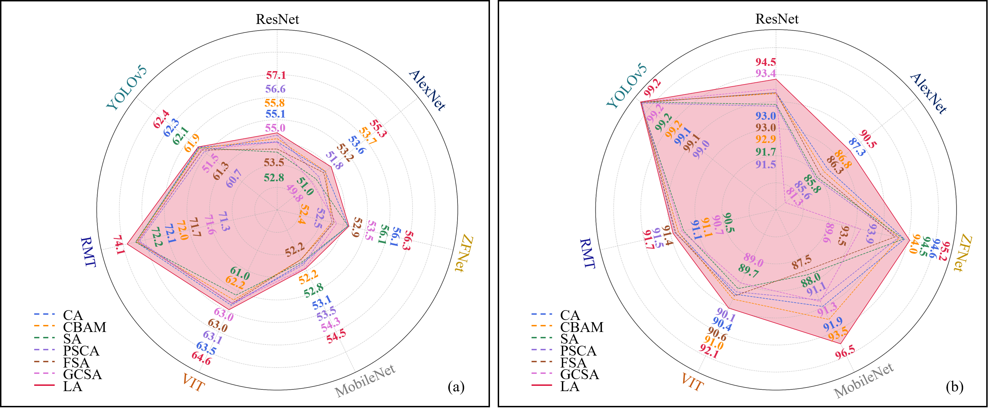

<h1 style="text-align: center;">Loosen Attention: Integrating Localized Channel and Coarse Spatial Attention for Enhanced Analysis of Complex Aurora Images</h1>
<div style="text-align: justify;">
Abstract: Auroral images present a significant challenge for automated analysis due to their highly variable and dynamic morphology, influenced by complex interactions between the solar wind and Earth’s magnetosphere. These natural phe-
nomena exhibit considerable randomness in shape, brightness, and motion, making them a unique and challenging signal source for artificial intelligence methods. In this work, we propose Loosen Attention (LA), a novel and lightweight at-
tention mechanism tailored to capture the unpredictable and fluid-like nature of
auroral patterns. LA integrates localized channel attention with coarse-grained
spatial attention, forming a flexible attention framework that enhances the ro-
bustness and adaptability of feature extraction in deep learning models. The
LA module is engineered around four key strategies: volumetric feature gener-
ation, volume-wise attention computation, refinement and reconstruction, and
enhanced feature fusion, enabling efficient focus on subtle yet significant auroral structures while tolerating less informative regions. Unlike conventional attention methods that may struggle with complex visual patterns, LA is explicitly designed to process diverse auroral images in a structured and computationally efficient way. We validate the LA mechanism on multiple vision tasks to demonstrate consistent performance improvements over state-of-the-art attention modules. The results highlight the potential of LA to improve deep learning pipelines in geospace imaging and other domains dealing with similarly complex natural signals. This work offers a promising AI-driven approach for intelligent processing of Earth-space interaction data and other visually ambiguous scientific images.
</div>

## Papar Information
- Title:  `Loosen Attention: Integrating Localized Channel and Coarse Spatial Attention for Enhanced Analysis of Complex Aurora Images`
- Authors:  `Qian Wang`,`Shihao Jing`,`Rui Yang`,`Zhenpei Liu`,`Yao Tang` and `Han Pan`

- 
<div style="text-align: justify;">
Figure 1: Illustration of the proposed attention mechanism: (a) the overall workflow incorporating our attention mechanism; (b) the volume-wise attention module; (c) the refinement attention reconstruction module; (d) the shared MLP used in the attention computation; and (e) the bi-pooling fusion strategy for integrating average and max pooling results.
</div>

- 
<div style="text-align: justify;">
Figure 2: Radar plots comparing the performance gains from different attention mechanisms across a range of network backbones. Each axis represents a distinct model integrated with channel and spatial attention variants, including AlexNet , ResNet34, ZFNet, MobileNet, ViT, RMT, and YOLOv5 (object detection). Larger enclosed areas indicate higher overall performance. (a) Results under a low-resource setting (4k training samples). (b) Results under a moderate-resource setting (10k training samples). The area enclosed by each curve reflects overall effectiveness. Larger areas indicate better performance.
</div>

## Install & Dependence
- python
- pytorch
- numpy
- matplotlib
- torchvision
- seaborn
- tqdm
- Scikit-Learn
- timm
- fvcore
- pyyaml

## Guidelines for use
### 1. For classification
- Introduction
  ```
  This Python script provides a complete training pipeline for four deep learning models (AlexNet_LA, resnet34_LA, zfnet_LA, and MobileNet_LA) for aurora image classification.
  ```
- Dateset
  ```
  dataset/
    ├── train/
    │   ├── class1/
    |   |   |── image0
    |   |   |── image1
    |   |   |── ...
    │   ├── class2/
    |   |   |── image0
    |   |   |── image1
    |   |   |── ...
    │   └── ... 
    └── val/
        ├── class1/
        |   |── image0
        |   |── image1
        |   |── ...
        ├── class2/
        |   |── image0
        |   |── image1
        |   |── ...
        └── ...
  ```

- for train
  ```
  python train.py \
    --model_name AlexNet_LA \         
    --num_classes 4 \                 
    --batch_size 128 \                
    --epochs 200 \                    
    --learning_rate 0.0001 \          
    --data_root "/path/to/dataset" \ 
    --save_path "best_model.pth"      
  ```
- for test
  ```
  python test.py \
    --data_root "/path/to/your/dataset" \   
    --model_name "resnet34_LA" \       
    --save_path "/path/to/model_weights.pth" \ 
    --log_dir "./logs" \                 
    --img_size 224 \                  
    --batch_size 32                          
  ```
### 2. For RMT
- Introduction
  ```
  This Python script provides a complete training pipeline for RMT_LA for the Aurora image classification task.
  ```
- Dateset
  ```
  dataset/
    ├── train/
    │   ├── class1/
    |   |   |── image0
    |   |   |── image1
    |   |   |── ...
    │   ├── class2/
    |   |   |── image0
    |   |   |── image1
    |   |   |── ...
    │   └── ... 
    └── val/
        ├── class1/
        |   |── image0
        |   |── image1
        |   |── ...
        ├── class2/
        |   |── image0
        |   |── image1
        |   |── ...
        └── ...
  ```

- for train
  ```
  python train.py \
    --data-path "/path/to/dataset" \ 
    --model RMT_S_LA \
    --output_dir "./output" \
    --batch-size 128 \
    --epochs 300 \
    --lr 8e-4 \ 
    --weight-decay 0.05 \
    --drop-path 0.2 \
    --input-size 224 \ 
    --num-workers 10 \
    --early-conv \ 
    --conv-pos \
    --model-ema \ 
    --distillation-type none \
    --mixup 0.8 \
    --cutmix 1.0 \
    --smoothing 0.1 \
    --seed 42 \
    --amp 
  ```
- for test
  ```
  python test.py \
    --resume /models/aurora_rmt.pth \
    --data-path /datasets/aurora/test_set \
    --model RMT_S_LA \
    --input-size 224 \
    --device cuda:0 \
    --num-workers 8 \
    --output-dir ./test_logs                         
  ```
### 3. For ViT
- Introduction
  ```
  This Python script provides a complete training pipeline for ViT_LA for the Aurora image classification task.
  ```
- Dateset
  ```
  dataset/
    ├── train/
    │   ├── class1/
    |   |   |── image0
    |   |   |── image1
    |   |   |── ...
    │   ├── class2/
    |   |   |── image0
    |   |   |── image1
    |   |   |── ...
    │   └── ... 
    └── val/
        ├── class1/
        |   |── image0
        |   |── image1
        |   |── ...
        ├── class2/
        |   |── image0
        |   |── image1
        |   |── ...
        └── ...
  ```

- for train
  ```
  python train.py \
    --data-root-train /path/to/train_data \
    --data-root-val /path/to/val_data \
    --img-size 224 \
    --patch-size 16 \
    --in-channels 3 \
    --embed-dim 768 \
    --depth 12 \
    --n-heads 12 \
    --mlp-ratio 4.0 \
    --dropout 0.1 \
    --batch-size 64 \
    --epochs 100 \
    --lr 3e-4 \
    --weight-decay 0.05 \
    --log-dir ./logs \
    --save-path ./checkpoints/best_model.pth \
  ```
- for test
  ```
  python test.py \
    --data-root-test /path/to/test_data \
    --img-size 224 \
    --patch-size 16 \
    --in-channels 3 \
    --embed-dim 768 \
    --depth 12 \
    --n-heads 12 \
    --mlp-ratio 4.0 \
    --dropout 0.1 \
    --batch-size 64 \
    --log-dir ./logs \
    --save-path ./checkpoints/best_model.pth \                     
  ```
### 4. For YOLOv5
- Introduction
  ```
  This Python script provides a complete training pipeline for YOLOv5_LA for the small-scale auroral structure detection task.
  ```

- for train
  ```
  python train.py \
    --data coco128.yaml \
    --weights yolov5s.pt \
    --img 640 \
    --batch-size 16 \
    --epochs 300 \
    --hyp data/hyps/hyp.scratch-low.yaml \
    --project runs/train \
    --name exp \
    --cache ram
  ```
- for test
  ```
  python val.py \
    --weights yolov5s.pt \
    --data coco128.yaml \
    --img 640 \
    --batch-size 32 \
    --conf-thres 0.25 \
    --iou-thres 0.45 \
    --task val \
    --device 0 \
    --name exp \
    --save-json                   
  ```
<!-- ## Pretrained model
| Model | Download |
| ---     | ---   |
| Model-1 | [download]() |
| Model-2 | [download]() |
| Model-3 | [download]() | -->
## Code Details
### Tested Platform
- software
  ```
  Python: 3.9
  PyTorch: 1.12.0
  ```
- hardware
  ```
  GPU: Nvidia RTX4090D (24GB)
  ```
## References
- [Imagenet classification with deep convolutional neural networks](https://dl.acm.org/doi/10.1145/3065386)
- [Deep residual learning for image recognition](https://ieeexplore.ieee.org/document/7780459)
- [Visualizing and understanding convolutional networks](https://link.springer.com/chapter/10.1007/978-3-319-10590-1_53)
- [Mobilenets: Efficient convolutional neural networks for mobile vision applications](https://inspirehep.net/literature/2730218)
- [An Image is Worth 16x16 Words: Transformers for Image Recognition at Scale](https://iclr.cc/virtual/2021/oral/3458)
- [Rmt: Retentive networks meet vision transformers](https://ieeexplore.ieee.org/document/10657584)
<!-- ## License

## Citing
If you use xxx,please use the following BibTeX entry.
```
``` -->
